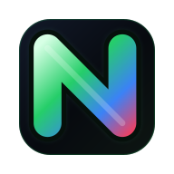

<p align="center">
  <a href="https://nullcost.xyz">
    
  </a>
</p>

<h1 align="center">Nullcost</h1>

<p align="center">
  Find developer tools with real free tiers and trials before your agent burns time browsing pricing pages.
</p>

<p align="center">
  <a href="https://nullcost.xyz"><strong>Open the catalog</strong></a>
  ·
  <a href="https://nullcost.xyz/install"><strong>Install the plugin</strong></a>
  ·
  <a href="plugins/nullcost-catalog"><strong>Plugin source</strong></a>
</p>

<p align="center">
  
  
  
  
  
  
</p>

---

## What This Is

Nullcost is a catalog for builders who want the cheapest useful path first:
free tiers, free trials, low-friction signup, and tools that fit small SaaS or
agent-built projects.

Instead of asking your AI coding tool to search the web for every pricing page,
you ask a normal question:

```text
What is a cheap auth service with a real free tier?
```

Nullcost answers from a structured catalog database and gives a compact
shortlist. For v1, it does **not** live-browse pricing pages during normal
recommendations.

## Why Install It

- Stop opening ten vendor tabs just to find out what is actually free.
- Ask plain-English questions like "cheap hosting" or "free-tier Postgres".
- Get DB-backed shortlists instead of hallucinated pricing guesses.
- Keep pricing/free-tier discovery separate from your main build work.
- Use the plugin path first, or raw MCP if your client prefers manual config.

## The Fast Path

Go to:

```text
https://nullcost.xyz/install
```

Copy the first prompt into your AI coding app. That is the noob-friendly path.

If your app cannot install repo plugins, use the manual MCP fallback on the same
page. Same catalog, less friendly setup.

## Good Test Prompts

```text
What is the best free-tier hosting for a small Next.js SaaS?
```

```text
Best free-tier auth service for a solo SaaS. I need email login and social login.
```

```text
Cheap hosting that will not surprise me with SSR costs.
```

```text
I need hosting, auth, Postgres, and transactional email with real free tiers.
```

```text
What is a good email API with a free trial?
```

## What Is Inside

| Part | What it does |
| --- | --- |
| Website | Browse free-entry developer services at `nullcost.xyz`. |
| Plugin | Adds Nullcost branding, routing, and no-slash-command behavior. |
| MCP server | Gives coding tools searchable catalog tools. |
| Supabase catalog | Stores providers, free-tier/free-trial flags, plans, and referral metadata. |
| Referral router | Supports public provider links while keeping private fields server-side. |

## Compatibility

| Client | Best path | Notes |
| --- | --- | --- |
| Codex | Plugin | Preferred path when local plugins are supported. |
| Claude / Claude Code | Plugin or MCP | Use plugin support if available; otherwise raw MCP config. |
| Cursor / Windsurf | MCP fallback | Use manual MCP config if plugin install is not supported. |
| Any MCP client | Raw MCP | Point it at the bundled MCP server. |

Client plugin support changes fast. If the plugin path fails, the raw MCP path
is the stable fallback.

## MCP Tools

Nullcost exposes four catalog tools:

| Tool | Use it for |
| --- | --- |
| `search_providers` | Search the catalog by keyword or category. |
| `recommend_providers` | Rank providers for one use case. |
| `recommend_stack` | Recommend a small stack like hosting + auth + Postgres + email. |
| `get_provider_detail` | Fetch one provider profile and plan context. |

## Local Development

Install dependencies:

```bash
npm install
```

Create local env:

```bash
cp .env.local.example .env.local
```

Start local Supabase:

```bash
npm run supabase:start
```

Seed the catalog:

```bash
npm run db:seed
```

Start the site:

```bash
npm run dev
```

Start the MCP server against the local site:

```bash
REFERIATE_API_BASE_URL=http://127.0.0.1:3000 npm run mcp:catalog
```

## Useful Commands

```bash
npm run lint
npm run build
npm run smoke
npm run version:check
```

`npm run smoke` expects the local site and Supabase stack to be running.

## Production Shape

The intended low-cost launch stack is:

| Layer | Default |
| --- | --- |
| Site/API | Netlify Free |
| Database/Auth | Supabase Free |
| Email | Resend Free |
| Agent access | Plugin first, raw MCP fallback |

Required production environment variables:

```text
NEXT_PUBLIC_SITE_URL
SITE_URL
NEXT_PUBLIC_SUPABASE_URL
NEXT_PUBLIC_SUPABASE_ANON_KEY
SUPABASE_URL
SUPABASE_ANON_KEY
SUPABASE_SERVICE_ROLE_KEY
NULLCOST_REVIEWER_EMAILS
```

Never commit production environment values. Store them in Netlify and Supabase.

## Versioning

Nullcost uses SemVer. The current version lives in:

- `VERSION`
- `package.json`
- plugin manifests
- skill frontmatter
- MCP server metadata

Run this before release:

```bash
npm run version:check
```

## Security Notes

- Do not commit `.env.local`, backups, production Supabase keys, or Netlify
  tokens.
- `SUPABASE_SERVICE_ROLE_KEY` must only live in trusted server environments.
- Public APIs are designed to hide private referral fields, internal notes, and
  raw metadata.
- Public referral profile claims stay pending until a reviewer approves them.
- Allowlisted reviewer accounts get the protected `site-admin` profile on
  dashboard sign-in.

## Open Source Boundary

This repo is Apache-2.0 licensed. You can fork it, run your own copy, and use it
commercially under the license terms.

The hosted Nullcost site, hosted database contents, production credentials,
referral routing data, and user data are not part of the open-source grant.

## Tags

`mcp` · `codex-plugin` · `claude-plugin` · `developer-tools` · `free-tier` ·
`supabase` · `nextjs` · `netlify` · `pricing-catalog` · `agent-tools`

## License

Apache-2.0. See [LICENSE](LICENSE).
